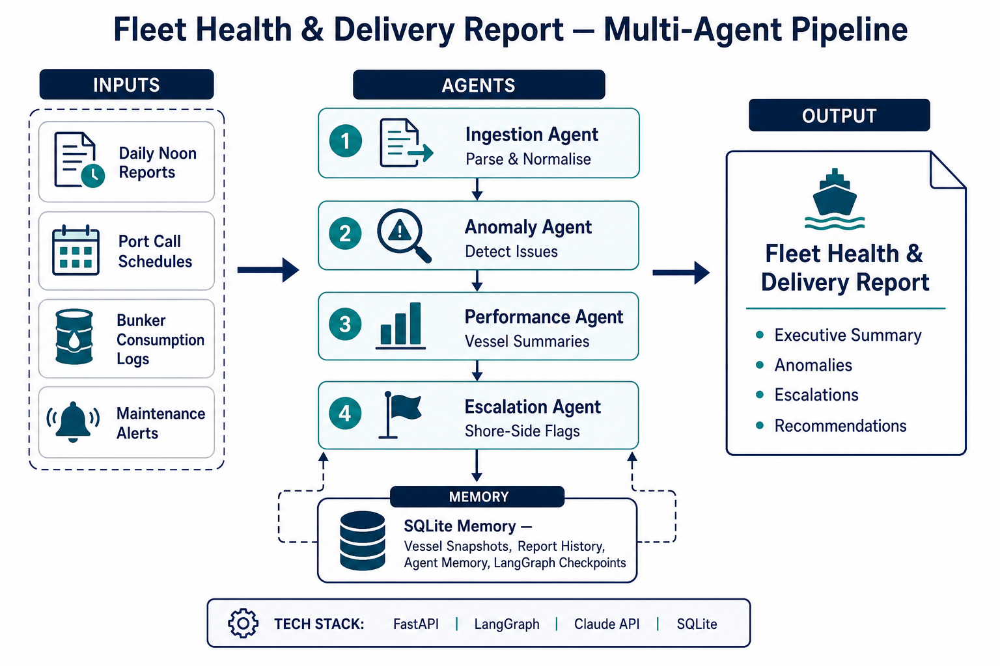

# Fleet Health & Delivery Report

Multi-agent AI pipeline that ingests maritime operational data — daily noon reports, port call schedules, bunker consumption logs, and maintenance alerts — and automatically generates a **Fleet Health & Delivery Report** for ship management operations teams.

Built with **LangGraph**, **FastAPI**, **Claude API**, and **SQLite**.



## Features

- **4 specialised agents** with tool-calling: Ingestion, Anomaly Detection, Performance Summary, Escalation
- **SQLite memory** for vessel snapshots, report history, agent context, and LangGraph checkpoints
- **Rule-based + LLM hybrid** anomaly detection (fuel overconsumption, schedule slippage, overdue maintenance)
- **REST API** with OpenAPI docs and sample data endpoint
- **Deterministic fallback** when no Claude API key is configured (CI-friendly)

## Project Structure

```
thinkpalm-agentai-agentops-teamalpha/
├── src/
│   ├── fleet_health/          # Application source code
│   │   ├── agents/            # LangGraph pipeline (4 agents + compiler)
│   │   ├── tools/             # Parser, anomaly, and memory tools
│   │   ├── memory/            # SQLite persistence layer
│   │   ├── schemas/           # Pydantic models
│   │   ├── config.py
│   │   └── main.py            # FastAPI application
│   └── data/
│       └── samples/           # Sample voyage, port, bunker, maintenance data
├── docs/
│   ├── architecture.png       # Architecture diagram
│   ├── architecture.pdf       # Architecture write-up (PDF)
│   └── architecture-writeup.md
├── tests/
│   ├── test_parsers.py
│   ├── test_anomaly_detector.py
│   ├── test_api.py
│   └── test_pipeline.py
├── requirements.txt
├── pyproject.toml
├── .env.example
└── README.md
```

## Prerequisites

- Python 3.11+
- Anthropic API key (optional — pipeline runs in deterministic mode without it)

## Setup

```powershell
# Clone and enter the repo
cd thinkpalm-agentai-agentops-teamalpha

# Create virtual environment
python -m venv .venv
.venv\Scripts\activate

# Install dependencies
pip install -r requirements.txt
pip install -e .

# Configure environment
copy .env.example .env
# Edit .env and set ANTHROPIC_API_KEY=sk-ant-...
```

## How to Run

### Start the API server

```powershell
# Option 1 — module entry point (recommended)
$env:PYTHONPATH = "src"
python -m fleet_health

# Option 2 — uvicorn directly
$env:PYTHONPATH = "src"
uvicorn fleet_health.main:app --reload --host 127.0.0.1 --port 8001
```

> **Note:** Port 8000 may be occupied by another local service. Default port is **8001**.

### Verify the service

Open in your browser:

| URL | Description |
|-----|-------------|
| http://127.0.0.1:8001/health | Health check |
| http://127.0.0.1:8001/docs | Swagger UI (interactive API docs) |
| http://127.0.0.1:8001/api/v1/agents | Agent catalogue |

### Generate a sample report

```powershell
Invoke-RestMethod -Method Post -Uri "http://127.0.0.1:8001/api/v1/reports/generate/sample"
```

Or with curl:

```bash
curl -X POST http://127.0.0.1:8001/api/v1/reports/generate/sample
```

## Screenshots

### Architecture Diagram

The multi-agent pipeline flows from four data inputs through four agents to a compiled fleet report, with SQLite memory throughout.


### API Health Check

```
GET http://127.0.0.1:8001/health

{
  "status": "healthy",
  "version": "1.0.0",
  "anthropic_configured": false,
  "sqlite_path": "D:\\...\\data\\fleet_memory.db"
}
```

### Swagger UI

Navigate to **http://127.0.0.1:8001/docs** to explore and test all endpoints interactively.

### Sample Report Output

A successful `POST /api/v1/reports/generate/sample` returns:

```json
{
  "thread_id": "uuid",
  "executive_summary": "Fleet Health Report for Fleet Alpha ...",
  "anomalies_count": 5,
  "escalations_count": 2,
  "recommendations": ["Immediate review of critical defects ..."],
  "report": { "vessel_summaries": [...], "anomalies": [...], "escalations": [...] }
}
```

## Running Tests

```powershell
$env:PYTHONPATH = "src"
pytest tests/ -v
```

## API Endpoints

| Method | Endpoint | Description |
|--------|----------|-------------|
| GET | `/health` | Service health |
| GET | `/api/v1/health` | Service health (alias) |
| POST | `/api/v1/reports/generate` | Generate from custom JSON payload |
| POST | `/api/v1/reports/generate/sample` | Generate from bundled sample data |
| GET | `/api/v1/reports/history` | Recent reports from SQLite |
| GET | `/api/v1/vessels/{vessel_id}/history` | Vessel snapshot history |
| GET | `/api/v1/agents` | Pipeline agent catalogue |

## Documentation

- [Architecture write-up (Markdown)](docs/architecture-writeup.md)
- [Architecture write-up (PDF)](docs/architecture.pdf)
- [Architecture diagram (PNG)](docs/architecture.png)

## Tech Stack

| Component | Technology |
|-----------|-----------|
| API | FastAPI + Uvicorn |
| Agents | LangGraph (4-agent sequential pipeline) |
| LLM | Claude API (Anthropic) |
| Memory | SQLite |
| Validation | Pydantic v2 |
| Tests | pytest |

## License

Internal — ThinkPalm AgentAI AgentOps Team Alpha
